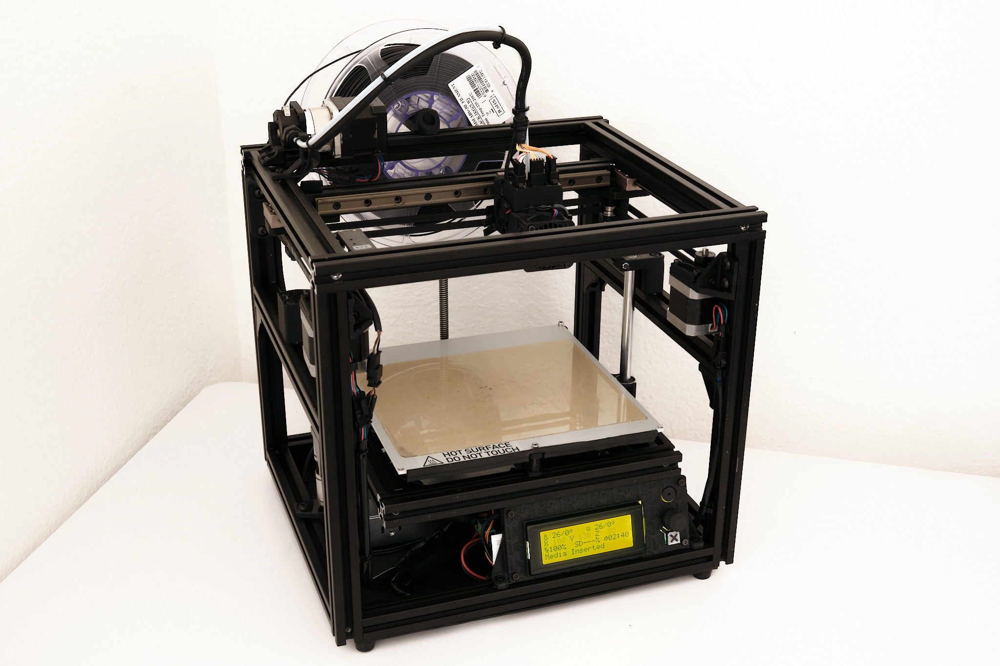
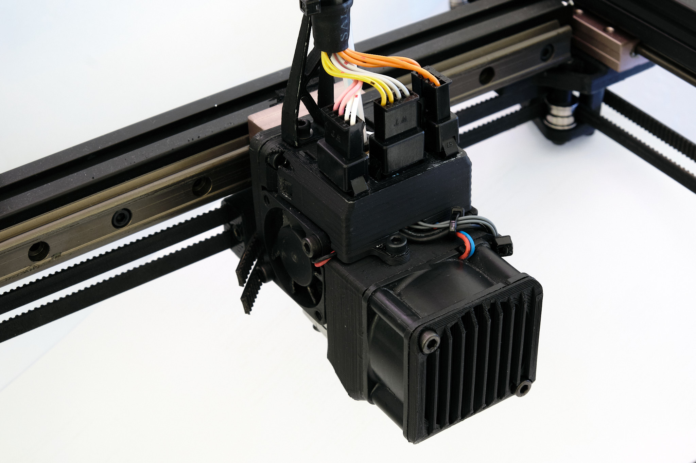
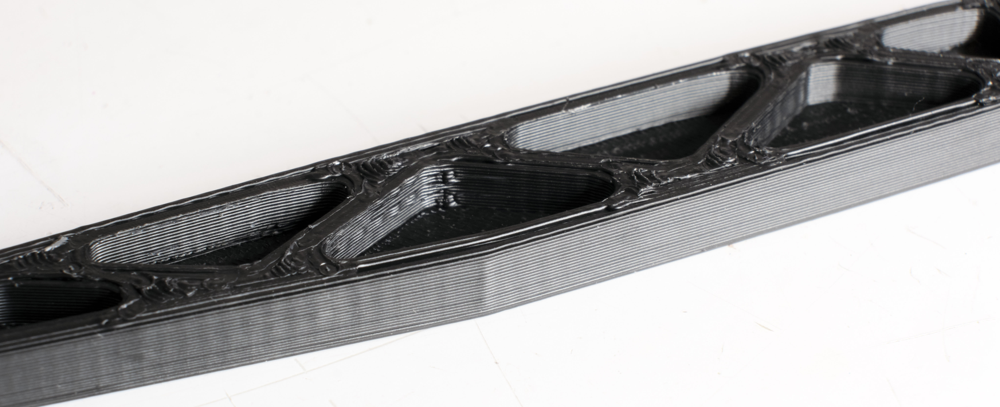
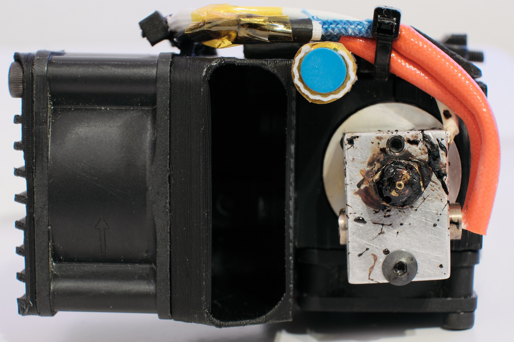
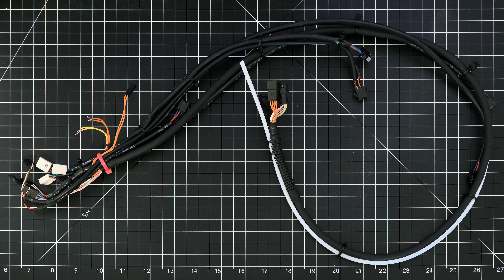
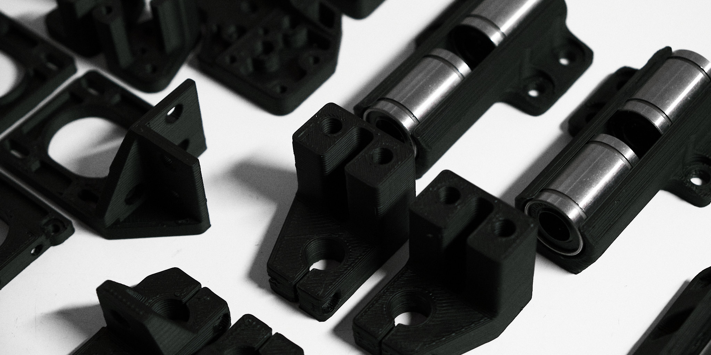
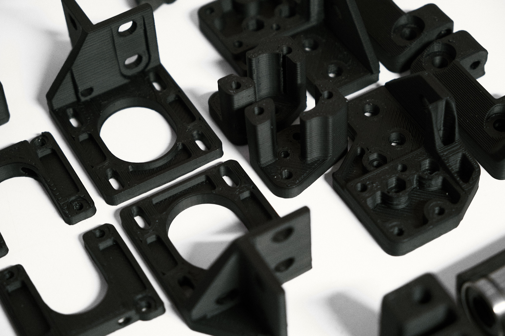
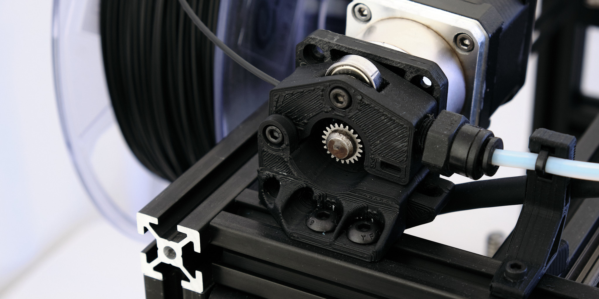
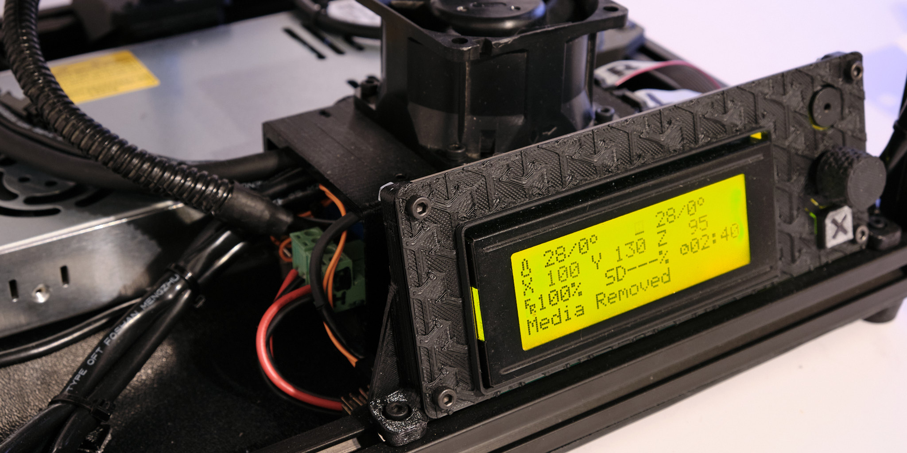
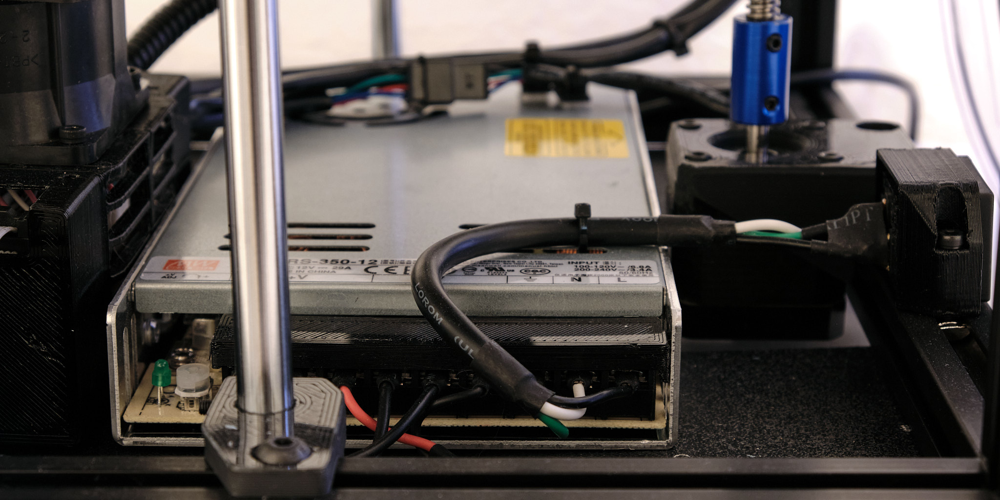

# smallXY

## Specifications
* Build volume: 200x160x100mm
* Frame: 330x300x300mm
* Weight: ~8kg
* Very rigid 2020 aluminum extrusion frame
* Capable of 150mm/s+ print speeds and 6000mm/s²+ acceleration
* 12mm linear rails on X and Y axes
* Leadscrew-driven Z axis with 10mm round linear shafts
* Simple mechanical design and clean cable management
* E3D V6 hotend with 1.75mm bowden setup
* MK3 aluminum heated bed with PEI print surface
* Compatible with a wide variety of control electronics
* Mean Well 350 watt power supply

#### Print Quality Samples

## CoreXY Motion System

SmallXY uses the simplest possible CoreXY motion system with no crossed belt paths, stationary motors, and no unnecessary idler pulleys. Idlers are constructed from pairs of FR623ZZ ball bearings for the best balance of cost to performance. Belt tensioning is integrated into the motor mounts so that the belts can be easily tensioned by turning screws accessible from the front of the printer. The rigid frame, linear rails, and a lightweight X-axis and toolhead allow high speed and very fast accelerations (at least 6000mm/s²).

## Toolhead

The toolhead fits an E3D V6 hotend, powerful 40x40x20mm part cooling fan, and inductive probe into a very compact 46mm wide package weighing less than 100g. The inductive probe is used for Z homing and optionally bed leveling using magnets attached to the underside of the heated bed.

## Wiring

Almost all of the printer's wiring is integrated into one fully connectorized harness that attaches to the frame using 3D printed snaps and 3M dual lock.

The toolhead is connected with JST SM connectors mounted in a 3D printed part for ease of servicing. The single 12-conductor high flexibility cable is supported by a 3D printed mount to eliminate any strain on the connectors.

## Design Files

**Disclaimer:** I cannot guarantee the correctness or completeness of anything in these design files and I am not planning to provide assembly instructions. These files are provided for inspiration and reference purposes only.

A STEP file of the CAD model, the BOM, and the Marlin configuration files can be downloaded from this GithHub repository. The latest version of the Solidworks 2020 CAD source files can be downloaded [here](https://workbench.grabcad.com/workbench/projects/gcE4_nd5ZVmsx_kgBHyB1wqYj7J80Bo0aavsQ_ukKZb6I6#/space/gccWt96S3aIfpnmZw99CCyJWk9YLHOaTK3aYx5E1uazplE). 

This work is licensed under a [Creative Commons Attribution-ShareAlike 4.0 International License](http://creativecommons.org/licenses/by-sa/4.0/).

