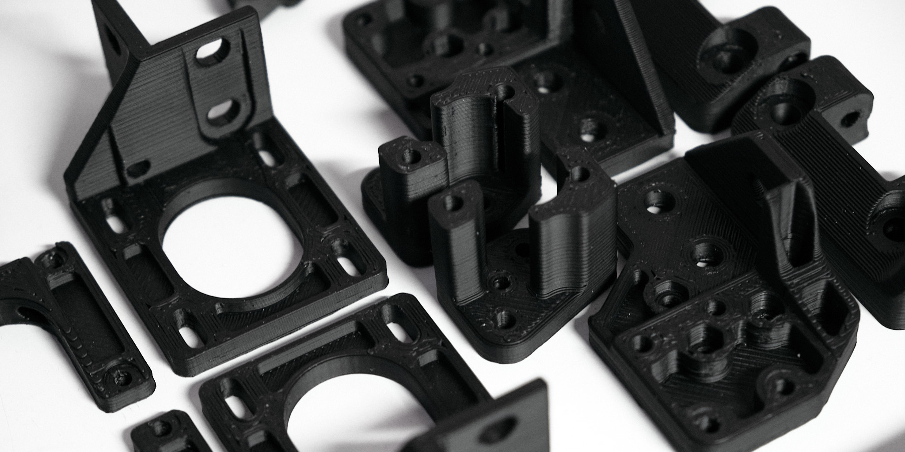
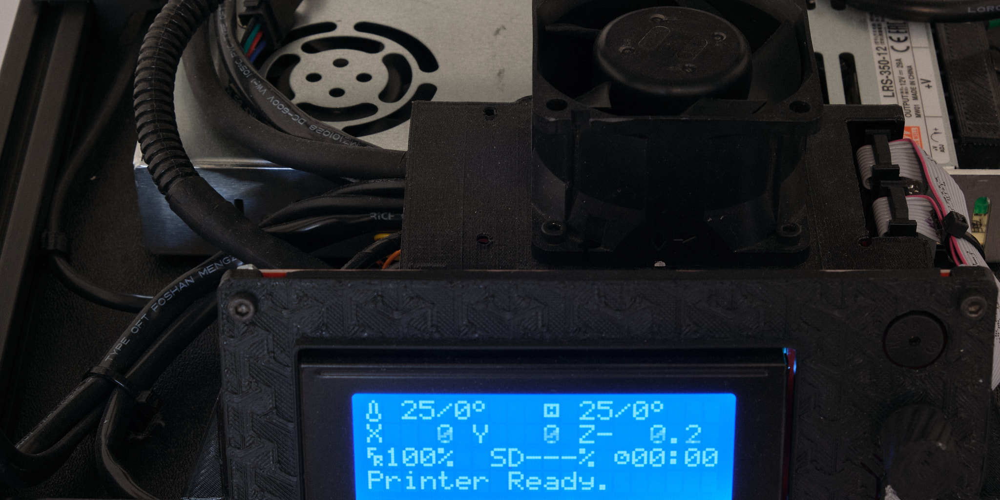
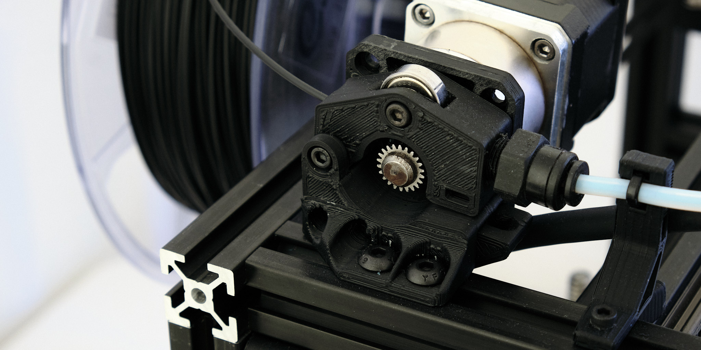

# smallXY

## Specifications (Version 1.0 - March 2021)
* Build volume: 200x160x120mm
* Capable of **150mm/s+** print speeds and **10000mm/s²+** acceleration
* Dimensions: 330x300x300mm
* Weight: ~8kg
* Very rigid 2020 aluminum extrusion frame
* 12mm linear rails on X and Y axes
* Leadscrew-driven Z axis with 10mm round linear shafts
* Simple mechanical design and clean cable management
* E3D V6 hotend with geared bowden extruder
* MK3 aluminum heated bed with PEI print surface
* Compatible with a wide variety of control electronics
* Mean Well 350 watt power supply

### Print Quality Sample - Bag Clip

Grid squares are 1/2in (12.7mm). Printed in PETG with 0.2mm layers. All print speeds 150mm/s except for external perimeters at 60mm/s; 10000mm/s² acceleration.

### Print Quality Sample - M8 Hex Bolt

Printed in PETG with 0.1mm layers. Maximum speed of 150mm/s on the bolt head and 50mm/s (necessary for cooling) on the threaded section; 10000mm/s² acceleration.

## CoreXY Motion System

SmallXY uses the simplest possible CoreXY motion system with front-mounted stationary motors, no crossed belt paths, and only 8 idler pulleys. Belt tensioners are integrated into the motor mounts so that the belts can be easily tensioned by turning screws accessible from the front of the printer. The rigid frame, linear rails, and a lightweight X-axis and toolhead allow high speed and very fast acceleration and cornering, producing fast and high quality prints with virtually no blobbing or stringing.

## Toolhead

The toolhead fits an E3D V6 hotend, 40x40x20mm axial part cooling fan with wide air duct, and inductive probe for Z homing and mesh bed leveling into a very compact 46mm wide package. The entire toolhead plus the X-axis linear rail carriage and belt clamp weigh only ~150g.

**Note:** The toolhead design shown in the photos is different from the current design shown in the CAD model above.

## Wiring

Almost all of the printer's wiring is integrated into one fully connectorized harness that attaches to the frame using 3D printed clips and 3M dual lock.

The toolhead is connected with JST SM connectors mounted in a 3D printed part for ease of servicing. All wiring to the toolhead runs through a 12-conductor high flexibility cable supported by a 3D printed mount to eliminate any strain on the connectors.

## Design Files

**Disclaimer:** I cannot guarantee the correctness or completeness of these design files and I am not planning to provide assembly instructions. Don't try to build this unless you know what you're doing.

STEP files of the v0.1 (May 2020) and v1.0 (March 2021) CAD models, which may not have the latest changes, the BOM, and the Marlin configuration files can be downloaded from this GitHub repository. The latest version of the Solidworks 2020 CAD source files and STL files for 3D printable parts can be downloaded [here](https://workbench.grabcad.com/workbench/projects/gcE4_nd5ZVmsx_kgBHyB1wqYj7J80Bo0aavsQ_ukKZb6I6#/space/gccWt96S3aIfpnmZw99CCyJWk9YLHOaTK3aYx5E1uazplE).

This work is licensed under a [Creative Commons Attribution-ShareAlike 4.0 International License](http://creativecommons.org/licenses/by-sa/4.0/).

